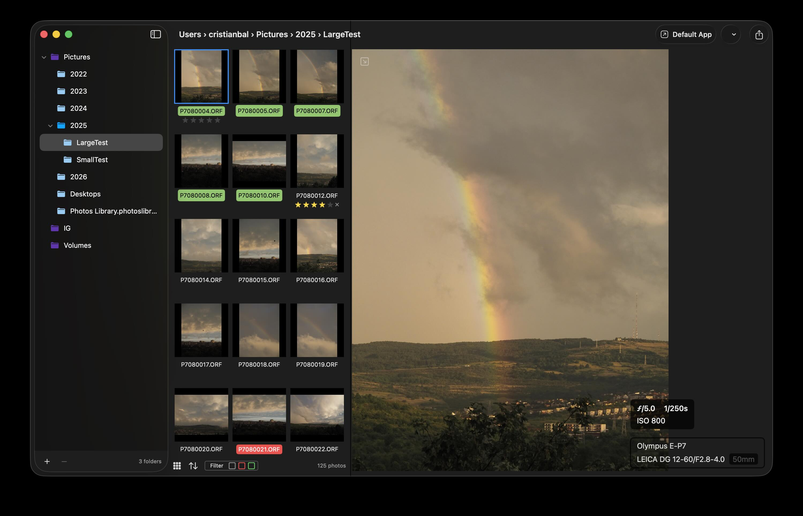
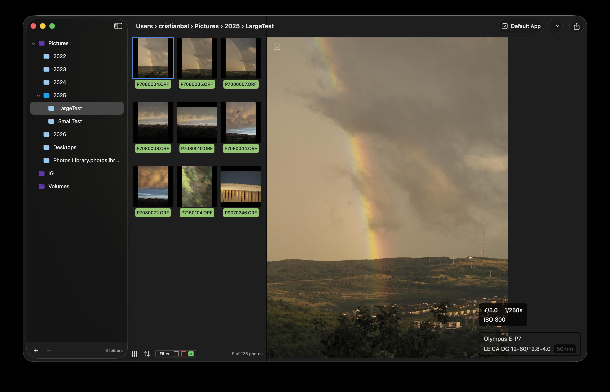
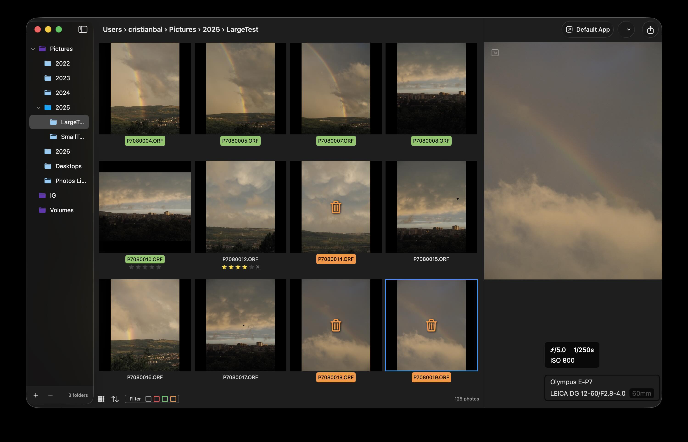
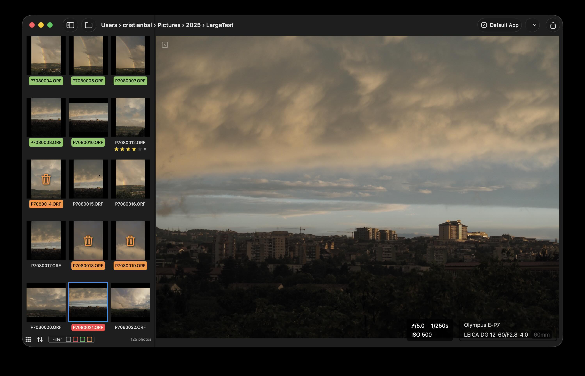
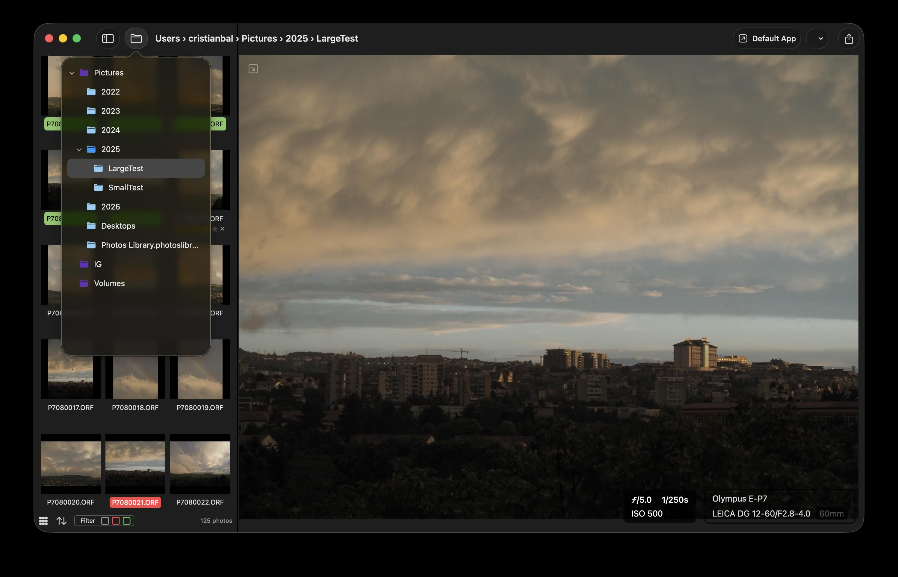

# Imagin Raw

A lightweight, fast, and native macOS application for managing and organizing RAW photos, built as an alternative to Adobe Bridge. Built by photographers for photographers

## Features
- **Add multiple root folders** from anywhere on your system or external drives
- **Real-time file system monitoring** - automatically detects new photos, deletions, and folder changes
- **RAW format support** app uses the libraw lib, many raw files are supported
- **Rating and labeling** compatible with Adobe Bridge
- **Mark for deletion** This will not delete the photos right away, it's a temporary label that you can filter for. This label is not preserver between album changes.
- **XMP metadata storage** - compatible with Adobe Lightroom and Bridge
- **Quickly switch between 2 grid types**

## Keyboard Shortcuts
- **Arrow Keys** - Navigate between photos
- **Cmd+A** - Select all photos
- **Cmd+Click / Shift+Click** - Multi-select photos
- **1-5** - Set star rating
- **6-0** - Apply labels
- **-** - Remove label
- **d or Delete** - Mark for deletion
- **Return** - Open selected photo(s) in external editor

## System Requirements
- macOS 14.6 or later
- Apple Silicon or Intel processor

## Installation

Download the latest release from Releases

